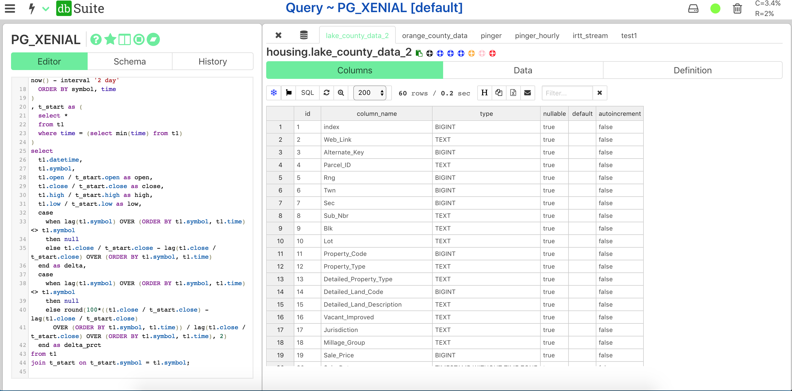
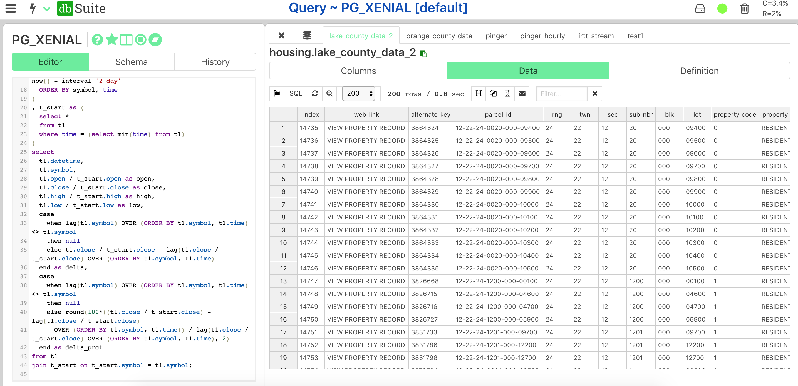
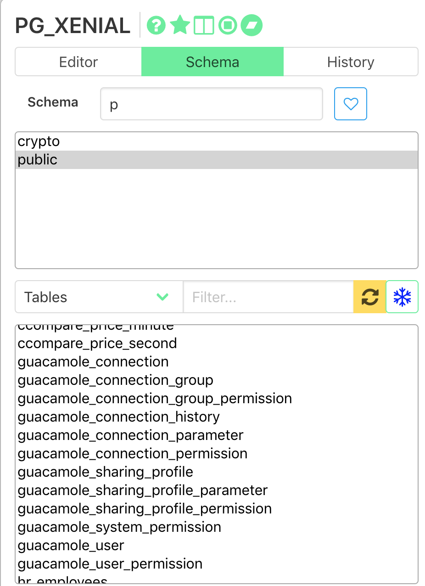

<p align="center">
  
</p>

DbNet is a Python/VueJS database client to access Oracle, Spark (Hive), Postgres, etc. It is still a work in progess, but should work fine for daily use. MS SQL Server is supported, although with some bugs here and there due to JDBC/JTDS bridge.

**Only Chrome and Firefox are supported at the moment.**

# Install
```bash
pip install dbnet
```

Command `dbnet` should now be available in the PATH.

# Running

`dbnet --help`

```bash
usage: dbnet [-h] [--serve] [--init_db] [--reset_db] [--force] [--port PORT]

DbNet Application

optional arguments:
  -h, --help   show this help message and exit
  --serve      Start the DbNet server
  --init_db    Initiatlize the backend SQLite database
  --reset_db   Reset the backend SQLite database
  --force      Kill any running instance.
  --port PORT  The web application port
```

`dbnet --serve`

```bash
2019-02-27 10:08:11 -- DB Tables OK.
2019-02-27 10:08:11 -- Main Loop PID is 39685
2019-02-27 10:08:11 -- Monitor Loop PID is 39691
2019-02-27 10:08:11 -- Web Server PID is 39692
2019-02-27 10:08:11 -- URL -> http://macbook:5566/?token=CqPahSJIeg1Nl4Kj
(39692) wsgi starting up on http://0.0.0.0:5566
```

## Setting up Dababase Profile

Your database profile / credentials needs to be set up at `~/profile.yaml` or env var `PROFILE_YAML`.
Run command `xutil-create-profile` to create from template.

### Example Entry

```yaml
PG1:
  name: PG1
  host: pg1
  database: db1
  port: 5432
  user: user
  password: password
  type: postgresql
  url: "jdbc:postgresql://host:port/database?&ssl=false"
```


# Screenshots







# Development

## Building

```bash
git clone https://github.com/flarco/dbnet.git
cd dbnet
bash build.sh
```

## Release

- Update version and `download_url` in [setup.py](./setup.py).
- Draft new release on Github: <https://github.com/flarco/dbnet/releases/new>

```
git clone https://github.com/flarco/dbnet.git
cd dbnete
python setup.py sdist && twine upload dist/*
```

# TODO

## API Endpoints:

**send**: initiated from server to client

**get & others**: initiated from client to server

- X stop-worker
- X get-workers
- send-workers (when changed by server / node)
- X add-worker
- X submit-sql
- X send-query-results (query-data)
- send-query-progress
- X set-state
- send-state (when changed by node)
- set-database
- X get-database
- send-database (when changed by node)
- get-meta-tables
- get-meta-columns
- X set-tab
- X get-tab
- send-tab (when changed by node)
- X get-tasks
- X get-queries
- X search-queries

## Tests

-X Unit tests as SOI Client

- Unit tests as Web Client

## Front-end

### Side menu

- Connections (drop-down) with plus sign to add
  - list databases. Clicking a db activates last query state
- Meta Explorer
- Extract / Load
- Settings

### Activities

- Query
  - Left pane is multi pane
    - Editor
      - Codemirror
    - Schema
    - History
  - A dropdown of sessions (past sessions are analysis sessions) with a plus button
- Meta Explorer
  - allows search accross databases for fields
- Transfer
  - Panes to select type of transfer, source, target, live search box, etc

### Top nav

- Logo brand (centered)
- Right side (socket status, CPU, RAM, processes count)

### Tabs

- META (Permanent)

## Shortcut Keys

### Editor

- F4 is to open schema tab
- F9 is execute SQL block
- F10 is to queue SQL block

## Features

- Ability to favorite a SQL snippet with a name, searchable
